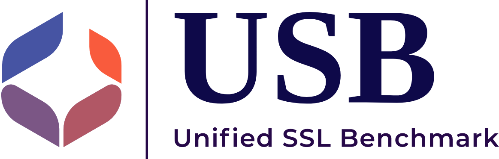

<div id="top"></div>
<!--
*** Thanks for checking out the Best-README-Template. If you have a suggestion
*** that would make this better, please fork the repo and create a pull request
*** or simply open an issue with the tag "enhancement".
*** Don't forget to give the project a star!
*** Thanks again! Now go create something AMAZING! :D
-->

<!-- PROJECT SHIELDS -->

<!--
*** I'm using markdown "reference style" links for readability.
*** Reference links are enclosed in brackets [ ] instead of parentheses ( ).
*** See the bottom of this document for the declaration of the reference variables
*** for contributors-url, forks-url, etc. This is an optional, concise syntax you may use.
*** https://www.markdownguide.org/basic-syntax/#reference-style-links
-->

<!-- [![Contributors][contributors-shield]][contributors-url]
[![Forks][forks-shield]][forks-url]
[![Stargazers][stars-shield]][stars-url]
[![Issues][issues-shield]][issues-url] -->
<!-- 
***[![MIT License][license-shield]][license-url]
-->

<!-- PROJECT LOGO -->

<div align="center">
<h2>SemiReward: A General Reward Model for Semi-supervised Learning</h2>
</div>

<!-- <br />
<div align="center">
  <a href="https://github.com/microsoft/Semi-supervised-learning">
    
  </a>

<p align="center">
    <strong>USB</strong>: A Unified Semi-supervised learning Benchmark for CV, NLP, and Audio Classification
    <br />
    <a href="https://arxiv.org/abs/2208.07204">Paper</a>
    ·
    <a href="https://github.com/microsoft/Semi-supervised-learning/tree/main/results">Benchmark</a>
    ·
    <a href="https://colab.research.google.com/drive/1lFygK31jWyTH88ktao6Ow-5nny5-B7v5">Demo</a>
    ·
    <a href="https://usb.readthedocs.io/en/main/">Docs</a>
    ·
    <a href="https://github.com/microsoft/Semi-supervised-learning/issues">Issue</a>
    ·
    <a href="https://www.microsoft.com/en-us/research/lab/microsoft-research-asia/articles/pushing-the-limit-of-semi-supervised-learning-with-the-unified-semi-supervised-learning-benchmark/">Blog</a>
    ·
    <a href="https://medium.com/p/849f42bbc32a">Blog (Pytorch)</a>
    ·
    <a href="https://zhuanlan.zhihu.com/p/566055279">Blog (Chinese)</a>
    ·
    <a href="https://nips.cc/virtual/2022/poster/55710">Video</a>
    ·
    <a href="https://www.bilibili.com/video/av474982872/">Video (Chinese)</a>
  </p>
</div> -->

<!-- TABLE OF CONTENTS -->

<details>
  <summary>Table of Contents</summary>
  <ol>
    <li><a href="#news-and-updates">News and Updates</a></li>
    <li><a href="#intro">Introduction</a></li>
    <li>
      <a href="#getting-started">Getting Started</a>
      <ul>
        <li><a href="#prerequisites">Prerequisites</a></li>
        <li><a href="#installation">Installation</a></li>
      </ul>
    </li>
    <li><a href="#usage">Usage</a></li>
    <li><a href="#contributing">Community</a></li>
    <li><a href="#license">License</a></li>
    <li><a href="#acknowledgments">Acknowledgments</a></li>
  </ol>
</details>

<!-- News and Updates -->

## News and Updates

- [10/08/2023] SemiReward has been released.

<!-- Introduction -->

## Introduction

Semi-supervised Reward framework (SemiReward) is designed to predict reward scores to evaluate and filter out high-quality pseudo labels, which is pluggable to mainstream Semi-Supervised Learning (SSL) methods in wide task types and scenarios. The results and details are reported in our paper [https://arxiv.org/abs/2310.03013]. The training of **SemiReward** is based on **USB**. 

_(**USB** is a Pytorch-based Python package for SSL. It is easy-to-use/extend, *affordable* to small groups, and comprehensive for developing and evaluating SSL algorithms. USB provides the implementation of 14 SSL algorithms based on Consistency Regularization, and 15 tasks for evaluation from CV, NLP, and Audio domain. More details can be seen in https://github.com/microsoft/Semi-supervised-learning)_


<p align="right">(<a href="#top">back to top</a>)</p>

<!-- GETTING STARTED -->

## Getting Started

First, you need to set up USB locally.
To get a local copy up, running follow these simple example steps.

### Prerequisites

USB is built on pytorch, with torchvision, torchaudio, and transformers.

To install the required packages, you can create a conda environment:

```sh
conda create --name usb python=3.8
```

then use pip to install required packages:

```sh
pip install -r requirements.txt
```

From now on, you can start use USB by typing 

```sh
python train.py --c config/usb_cv/fixmatch/fixmatch_cifar100_200_0.yaml
```

### Installation

USB provide a Python package *semilearn* of USB for users who want to start training/testing the supported SSL algorithms on their data quickly:

```sh
pip install semilearn
```

<p align="right">(<a href="#top">back to top</a>)</p>

### Development

You can also develop your own SSL algorithm and evaluate it by cloning USB:

```sh
git clone https://github.com/microsoft/Semi-supervised-learning.git
```

<p align="right">(<a href="#top">back to top</a>)</p>


### Prepare Datasets

The detailed instructions for downloading and processing are shown in [Dataset Download](./preprocess/). Please follow it to download datasets before running or developing algorithms.

<p align="right">(<a href="#top">back to top</a>)</p>


<!-- USAGE EXAMPLES -->

## Usage

### Start with Docker
The following steps to train your own SemiReward model just as same with USB.

**Step1: Check your environment**

You need to properly install Docker and nvidia driver first. To use GPU in a docker container
You also need to install nvidia-docker2 ([Installation Guide](https://docs.nvidia.com/datacenter/cloud-native/container-toolkit/install-guide.html#docker)).
Then, Please check your CUDA version via `nvidia-smi`

**Step2: Clone the project**

```shell
git clone https://github.com/microsoft/Semi-supervised-learning.git
```

**Step3: Build the Docker image**

Before building the image, you may modify the [Dockerfile](Dockerfile) according to your CUDA version.
The CUDA version we use is 11.6. You can change the base image tag according to [this site](https://hub.docker.com/r/nvidia/cuda/tags).
You also need to change the `--extra-index-url` according to your CUDA version in order to install the correct version of Pytorch.
You can check the url through [Pytorch website](https://pytorch.org).

Use this command to build the image

```shell
cd Semi-supervised-learning && docker build -t semilearn .
```

Job done. You can use the image you just built for your own project. Don't forget to use the argument `--gpu` when you want
to use GPU in a container.

### Training

Here is an example to train one of baselines FlexMatch on CIFAR-100 with 200 labels. Training other supported algorithms (on other datasets with different label settings) can be specified by a config file:

```sh
python train.py --c config/usb_cv/flexmatch/flexmatch_cifar100_200_0.yaml
```

Here is an example to train FlexMatch with SemiReward on CIFAR-100 with 200 labels. Training other baselines with SemiReward can be specified by a config file:

```sh
python train.py --c config/SemiReward/usb_cv/flexmatch/flexmatch_cifar100_200_0.yaml
```
You can change hyperparameters for SemiReward by configurations (.yaml files) like other baselines. If you want to change loss or something is fixed in our method for SemiReward, it is recommanded to open flie from:

```sh
semilearn/algorithms/srflexmatch/srflexmatch.py
```

### Evaluation

After training, you can check the evaluation performance on training logs, or running evaluation script:

```
python eval.py --dataset cifar100 --num_classes 100 --load_path /PATH/TO/CHECKPOINT
```

### Develop

Check the developing documentation for creating your own SSL algorithm!

_For more examples, please refer to the [Documentation](https://example.com)_

<p align="right">(<a href="#top">back to top</a>)</p>

<!-- BENCHMARK RESULTS -->

## Contributing

If you have any ideas to improve SemiReward, we welcome your contributions! Feel free to fork the repository and submit a pull request. Alternatively, you can open an issue and label it as "enhancement." Don't forget to show your support by giving the project a star! Thank you once more!

1. Fork the project
2. Create your branch (`git checkout -b your_name/your_branch`)
3. Commit your changes (`git commit -m 'Add some features'`)
4. Push to the branch (`git push origin your_name/your_branch`)
5. Open a Pull Request

<p align="right">(<a href="#top">back to top</a>)</p>

<!-- TRADEMARKS -->

## License

Distributed under the MIT License. See `LICENSE.txt` for more information.

<p align="right">(<a href="#top">back to top</a>)</p>

<!-- CONTACT -->

## Citing SemiRward

Please cite us if you fine this project helpful for your project/paper:

```
@article{li2023semireward,
  title={SemiReward: A General Reward Model for Semi-supervised Learning},
  author={Siyuan Li and Weiyang Jin and Zedong Wang and Fang Wu and Zicheng Liu and Cheng Tan and Stan Z. Li},
  journal={arXiv preprint arXiv:2310.03013},
  year={2023}
}

```

<!-- ACKNOWLEDGMENTS -->

## Acknowledgments

We thanks the following projects for reference of creating SemiReward:

- [USB](https://github.com/microsoft/Semi-supervised-learning))
- [TorchSSL](https://github.com/TorchSSL/TorchSSL)
- [FixMatch](https://github.com/google-research/fixmatch)
- [CoMatch](https://github.com/salesforce/CoMatch)
- [SimMatch](https://github.com/KyleZheng1997/simmatch)
- [HuggingFace](https://huggingface.co/docs/transformers/index)
- [Pytorch Lighting](https://github.com/Lightning-AI/lightning)
- [README Template](https://github.com/othneildrew/Best-README-Template)

<p align="right">(<a href="#top">back to top</a>)</p>

